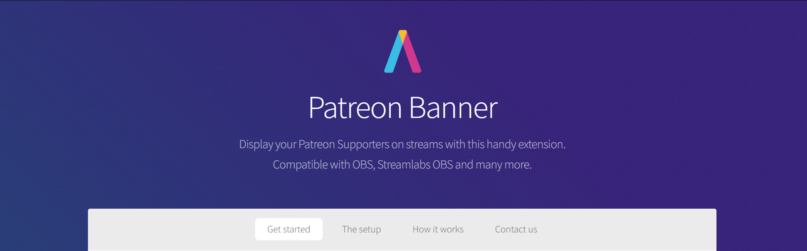

> This is the source code for the web app available from [patreonbanner.com](https://patreonbanner.com). This project is split into multiple pieces to support the way Twitch wants their extensions to work. 

The different modes:

- Component development: `npm run storybook` _(open http://localhost:6006)_
  - Stories are defined next to the components in the `.stories.tsx` files
- Run main website: `npm start` _(open https://localhost:8080)_
  - `https` required for preview in Twitch panel
